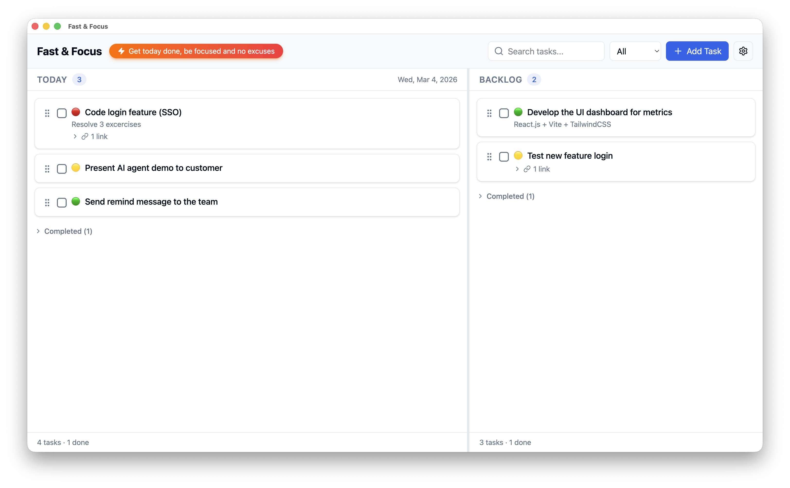

# Fast & Focus - Minimal Task Manager

> A fast, minimal task manager for macOS, Windows, and Linux. Add tasks, get them done.

*"Get today tasks done — Focus — No excuse"*



## Features

- **Two boards** — Today (focused work) and Backlog (everything else)
- **Task CRUD** — Add, edit, delete, and mark tasks done
- **Drag-and-drop** — Reorder tasks within a board
- **Move tasks** — Drag or click to move between Today and Backlog
- **Link tasks** — Connect tasks as related, blocks, or blocked by
- **Priority labels** — High (🔴), Medium (🟡), Low (🟢)
- **Search** — Find tasks by title across both boards
- **Filter** — All, Pending, or Done
- **Auto-cleanup** — Tasks older than 30 days are purged on launch
- **About dialog** — App version and build info
- **Local-first** — All data stored locally in SQLite. No server required.

## Tech Stack

| Layer | Technology |
|-------|-----------|
| Frontend | React 19 + TypeScript + Tailwind CSS |
| UI Components | shadcn/ui + Radix UI + Lucide icons |
| Desktop Shell | Electron |
| Backend | Node.js (Electron main process + IPC) |
| Database | SQLite (better-sqlite3) |
| Drag & Drop | @dnd-kit |
| Data Fetching | TanStack Query |
| Build | Vite + vite-plugin-electron + electron-builder |

## Getting Started

### Prerequisites

- Node.js 20+
- npm 10+

### Install

```bash
npm install
```

### Development

```bash
npx vite
```

This starts the Vite dev server and auto-launches the Electron app.

### Production Build

```bash
npm run build:electron
```

Outputs packaged app to `release/`.

## License

MIT
